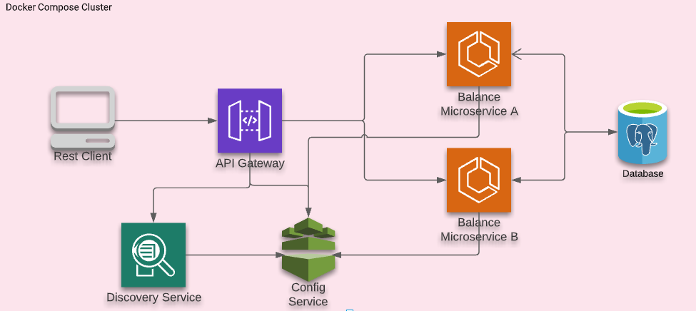

# Savings Account with API-GW

Demonstration of Spring Cloud with Spring Boot

## Getting Started

The project uses maven for building the dependencies, mainly using Spring Boot and Spring Cloud.

### Technologies

- Spring Boot
- Spring Cloud
- PostrgreSQL
- Docker

### Setup environment

First do the following:
1. Clone the project from Github
2. Make sure you have java setup on your machine. I tested with java 17, so if you face any issues switch to newer version of java.

Now we can run the project in 2 ways:
1. On docker
2. Locally

### Setup using Docker

1. Now run the below commands in multiple terminals. In one terminal is also fine, but logs jumble up with Rancher
```bash
make mvn-build
docker-compose up -d db
docker-compose up --build config-service
docker-compose up --build discovery-service
docker-compose up --build api-gateway
docker-compose up --build balance-service-a
docker-compose up --build balance-service-b
```

### Setup Locally

To run locally, we require Intellij Idea. Runconfigurations are present in `./run` folder.

Run the services in following order:

0. Run `docker-compose up -d db`
1. Run config service
2. Run discovery service
3. Run api-gateway
4. Run balance-service-a
5. Run balance-service-b


### Setting up DB

We are auto generating schema via jpa. So, no need to create tables, but we still need to seed the data, as that part is not automated yet.

So, to do that connect to postgres console and insert the data in account_master table:

```sql
insert into account_master values ('a', 0);
insert into account_master values ('b', 0);
```

### Check if API is working

1. To get the balance for account a:
```bash
curl --location --request GET 'http://localhost:8080/savings/a/balance'
```
Likewise for b:
```bash
curl --location --request GET 'http://localhost:8080/savings/b/balance'
```
2. To update the balance for account a:
```bash
curl --location --request POST 'http://localhost:8080/savings/a/balance' \
--header 'Content-Type: application/json' \
--data-raw '{
    "amount": -190
}'

```
For account b, change the url to `http://localhost:8080/savings/b/balance`.
Negative amount means deduction, positive amount means crediting the money.


## Architecture

The app uses microservice architecture.



### Config Service

[Spring Cloud Config](http://cloud.spring.io/spring-cloud-config/spring-cloud-config.html) is horizontally scalable centralized configuration service for the distributed systems. 
It uses a pluggable repository layer that currently supports local storage, Git, and Subversion.

We have added different service configs to classpath of config-service under `services` in resources.

### Discovery Service

Service Discovery OR Registry allows automatic detection of the network locations for all registered services. 
These locations might have dynamically assigned addresses due to auto-scaling, failures or upgrades.

When some other service wants to communicate with a already registered service, they would ask the Eureka Server the base url for that service. 
Multiple instances of the same service could register with Eureka, in that case Eureka could help in doing Load Balancing.

### API Gateway

We used api gateway from [Spring Cloud](https://spring.io/guides/gs/gateway/). 
API Gateway is a single entry point into the system, used to handle requests and routing them to the appropriate backend service, aggregates results and also club similar endpoints for eg. swagger endpoint of different services.
In our case API gateway logs the info for each incoming request using `LoggingFilter`. Also, I have to do the pattern matching for routes in code in `apis()` method.

### Balance Service

This is a typical spring boot app, with business logic and database connection to postgres. We deployed 2 containers for Balance service:
- Balance Service A
- Balance Service B

The way we do it using different configuration and app name. The code stays the same, just the config is different.

Also, we are sharing the database connection, but we shouldn't if we want to separate data or there a large load from one of the service

The swagger openapi config can be found here: `http://{service}:{port}/v3/api-docs`.

## TODOs

1. Separate out the DB for balance-service-a and balance-service-b. Basically each microservice having its on data.
2. Add the e2e tests for the Balance service
3. Add unit tests in different services
4. Multi-stage docker image for spring boot modules

## Q&A

### Scaling API Gateway

We can easily scale the containers, for eg. balance service:
```bash
docker-compose up --scale balance-service-a=4
```

We are already using the endpoint in api-gateway.yml like this `lb:<servicename>`. 

For the scaling of the api-gateway, we deploy multiple containers/pods of api-gateway and let spring load balancer do the load balancing.

### Monitoring the app

There are multiple ways possible. Here is one possible solution for self-hosted monitoring. We can use [Micrometer](https://micrometer.io/).
We can stream this data to: 
1. some time series db like influxdb OR
2. we can use some full alerting system like Prometheus OR
3. database like Elasticsearch.

For 1st case, visualization has to be figured out, there are open source viz tools supporting it.
For 2nd case, we can use Grafana, and create alerts and charts on it.
For 3rd case, we can use Kibana and create alerts and charts on it.

We can also stream this data to 3rd party APM like new relic and create alerts there.

